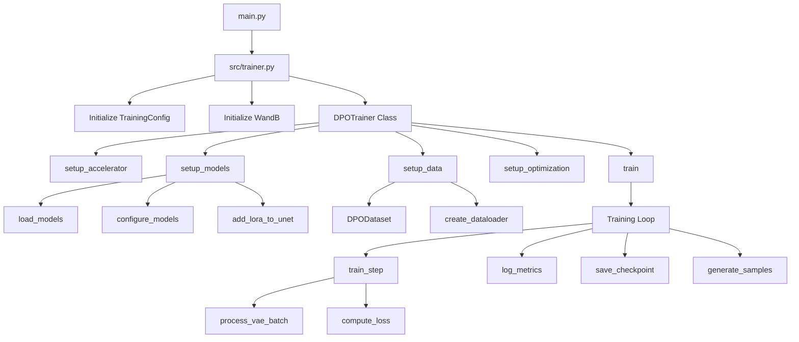

# SDXL DPO Training

This repository contains code for training Stable Diffusion XL using Direct Preference Optimization (DPO) with LoRA.

## Code Flow Diagram



## Component Details

### 1. Entry Points
- `main.py`: Entry point of the application
  - Adds src to Python path
  - Calls training function

### 2. Configuration (`config/training_config.py`)
- `TrainingConfig`: Dataclass containing all training parameters
  - Model configuration
  - Training hyperparameters
  - Memory optimization settings
  - Scheduler configuration
  - File paths

### 3. Core Training (`src/trainer.py`)
- `DPOTrainer`: Main trainer class
  - Initialization and setup
  - Training loop management
  - Checkpoint handling
  - Metrics logging

#### Key Methods:
- `setup_accelerator()`: Configures distributed training
- `setup_models()`: Loads and configures SDXL components
- `setup_data()`: Prepares dataset and dataloader
- `setup_optimization()`: Configures optimizers and schedulers
- `train()`: Main training loop
- `train_step()`: Single training iteration
- `generate_samples()`: Creates sample images during training

### 4. Data Handling (`src/data/dataset.py`)
- `DPODataset`: Custom dataset class
  - Loads paired images (preferred/rejected)
  - Applies transformations
  - Memory-efficient processing
- `create_dataloader`: DataLoader configuration
  - Batch creation
  - Memory pinning
  - Shuffle settings

### 5. Model Utils (`src/models/model_utils.py`)
- Model loading functions
- LoRA configuration
- Memory optimization settings
- Model freezing and unfreezing

### 6. Training Utils (`src/utils/training_utils.py`)
- GPU memory monitoring
- Sample generation utilities
- Optimization helpers
- Logging functions

## Training Flow

1. **Initialization**
   ```python
   config = TrainingConfig()
   trainer = DPOTrainer(config)
   ```

2. **Setup Phase**
   ```python
   # Automatic setup during initialization
   trainer.setup_accelerator()  # Distributed training setup
   trainer.setup_models()       # Load and configure models
   trainer.setup_data()         # Prepare dataset
   trainer.setup_optimization() # Configure training
   ```

3. **Training Loop**
   ```python
   trainer.train()
   # For each epoch:
   #   For each batch:
   #     - Process VAE batches
   #     - Generate noise
   #     - Compute predictions
   #     - Calculate DPO loss
   #     - Update models
   #     - Log metrics
   #     - Save checkpoints
   #     - Generate samples
   ```

## Memory Management

Key optimizations for handling large models:

1. **Gradient Checkpointing**
   - Trades computation for memory
   - Enabled in UNet

2. **Mixed Precision Training**
   - Uses FP16 for most operations
   - Reduces memory usage

3. **Memory Efficient Attention**
   - xformers for attention computation
   - Significant memory savings

4. **Batch Processing**
   - Small batch sizes
   - Gradient accumulation
   - VAE processing in micro-batches

## Setup and Usage

1. Create environment:
```bash
conda create -n sdxl-dpo python=3.10
conda activate sdxl-dpo
```

2. Install PyTorch:
```bash
conda install pytorch torchvision torchaudio pytorch-cuda=12.1 -c pytorch -c nvidia
```

3. Install requirements:
```bash
pip install -r requirements.txt
```

4. Configure training:
```python
# Edit config/training_config.py
@dataclass
class TrainingConfig:
    pretrained_model_name_or_path: str = "stabilityai/stable-diffusion-xl-base-1.0"
    # ... other configurations
```

5. Run training:
```bash
python main.py
```

## Monitoring

Training progress can be monitored through:
- WandB dashboard
  - Loss metrics
  - Learning rates
  - Generated samples
- Console output
  - Training progress
  - GPU memory usage
  - Error logging

## Requirements

- Python 3.10+
- PyTorch 2.1+
- CUDA capable GPU
- 24GB+ VRAM recommended

## License

This project is licensed under the MIT License - see the LICENSE file for details.